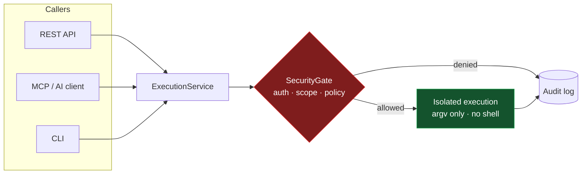
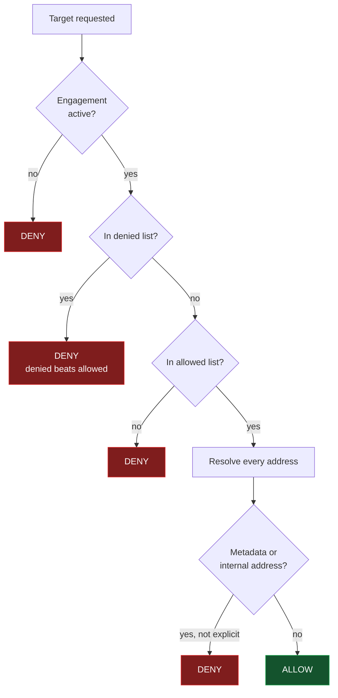

# NexHunter

<div align="center">
  

  <strong>Policy-Driven AI Security Orchestration</strong>

  <p>Secure-by-default orchestration of security tools for <em>authorized</em> assessments.</p>

   
</div>

---

> [!WARNING]
> **Only use NexHunter against systems you own or are explicitly authorized to assess.**
> Scope enforcement encodes an authorization you already have. It does not grant one.

---

## What it is

NexHunter orchestrates external security tools behind a policy engine. It does
not implement scanners — it decides whether a scan may run, runs it safely, and
records what happened.

The distinguishing property: **an AI client is a caller like any other.** It can
propose a tool and parameters. It cannot propose a command, widen its own scope,
or overrule the policy engine.



## Quick start

```bash
git clone https://github.com/Arseno25/nexhunter.git
cd nexhunter
pip install -e ".[mcp]"

nexhunter doctor          # check this installation can actually run

# Declare what you are authorized to test. Nothing runs until you do.
nexhunter engagement create --id ENG-001 \
  --target example.com --target '*.example.com' \
  --deny admin.example.com --risk passive --risk active
```

Then start the server and, optionally, the MCP bridge:

```bash
python -m nexhunter.api.server --port 8888
python -m nexhunter.api.mcp --server http://127.0.0.1:8888 --profile nexhunter-recon
```

## MCP setup

Add to your AI client's config (Claude Desktop, Claude Code, Cursor, VS Code,
Roo Code, OpenCode — see [docs/mcp/](docs/mcp/)):

```json
{
  "mcpServers": {
    "nexhunter": {
      "command": "python",
      "args": [
        "-m", "nexhunter.api.mcp",
        "--server", "http://127.0.0.1:8888",
        "--profile", "nexhunter-core"
      ],
      "env": { "NEXHUNTER_API_TOKEN": "your-token-here" }
    }
  }
}
```

### Profiles

Listing ~170 tools to every client makes for a large payload, a large token
cost, and a model choosing blindly between near-identical tools. A profile
narrows that to one job.

| Profile | Tools | Purpose |
|---|---:|---|
| `nexhunter-core` | 7 | **Default.** Status, findings, executions, passive stable checks |
| `nexhunter-recon` | 15 | Host discovery, DNS, subdomains, service identification |
| `nexhunter-web` | 13 | Content discovery, template scanning, tech identification, TLS |
| `nexhunter-api` | 13 | Schema and parameter discovery, GraphQL |
| `nexhunter-code` | 10 | Static analysis, secret scanning, dependency review |
| `nexhunter-cloud` | 8 | Read-only cloud posture |
| `nexhunter-container` | 10 | Container and Kubernetes review |
| `nexhunter-forensics` | 17 | Offline artifact and binary analysis |
| `nexhunter-full` | 172 | Everything non-destructive. Large payload |

```bash
nexhunter profiles                          # list them
nexhunter profiles --name nexhunter-web     # see what one exposes
```

No profile lists a destructive tool. Profiles are a usability control, not a
security control — the policy engine authorizes every execution regardless of
which profile surfaced the tool.

## Security model



Enforced and covered by tests:

- **No arbitrary command execution.** No tool takes a command parameter, no
  builder splits a string into argv, no path uses a shell. Shell metacharacters
  stay inert as single literal arguments.
- **Fail-closed scope.** No engagement or an empty allow-list denies everything.
  Denied beats allowed. `*.example.com` does not match `evil-example.com`.
- **SSRF and rebinding blocked.** Every resolved address is checked. Cloud
  metadata is blocked unconditionally, including via IPv4-mapped IPv6.
- **Risk-tiered policy.** passive → active → intrusive → destructive, each
  requiring more. Destructive is disabled by default and needs admin plus an
  approval record.
- **Contained execution.** Isolated workspace per run, timeouts that kill the
  whole process tree, output caps, no path traversal or symlink escape.
- **Secrets redacted** from parameters, commands, logs, and output.
- **Everything audited**, including denials.

Full detail, and an explicit list of what is *not* guaranteed, in
[docs/security-model.md](docs/security-model.md).

## CLI

```bash
nexhunter doctor                              # environment health check
nexhunter registry list --category recon      # browse the registry
nexhunter registry check                      # which binaries are installed
nexhunter registry info nmap_scan             # describe one tool
nexhunter profiles                            # MCP profiles
nexhunter engagement create --id ENG-001 --target example.com
nexhunter engagement list                     # stored engagements
nexhunter engagement show ENG-001             # one engagement's scope
nexhunter engagement status ENG-001 paused    # pause, complete, cancel, resume
nexhunter engagement validate scope.json      # check a file before relying on it
```

`doctor` reports what is true about your environment and never changes it:

```
NexHunter Doctor

Core
  [OK] Python 3.13.7
  [OK] Data directory writable
  [WARN] API token not configured
  [OK] Server binds to loopback (127.0.0.1)
  [OK] Process execution works

Security
  [OK] Raw command execution disabled (registry tools only)
  [OK] No execution path uses a shell
  [OK] Destructive tools disabled

Stable tools (8/24 installed)
  [OK] nmap_scan (nmap 7.80)
  [OK] curl_headers (curl 8.12.1)
  [MISSING] 16 other stable tools not installed
```

NexHunter never installs binaries for you.

## API

```bash
curl -H "Authorization: Bearer $NEXHUNTER_API_TOKEN" \
     -X POST http://127.0.0.1:8888/api/command \
     -d '{"tool": "nmap_scan", "params": {"target": "example.com", "ports": "80,443"}}'
```

| Endpoint | Purpose |
|---|---|
| `GET /health` `/ready` `/version` | Public, no auth |
| `GET /api/tools` | Registry, filterable by category, risk, maturity, availability |
| `GET /api/tools/{name}` | One tool's metadata |
| `GET /api/tools/status` | What is installed |
| `POST /api/command` | Run a registered tool |
| `GET /api/executions` | Execution history with status and policy decision |
| `GET /api/executions/{id}/output` | Captured output, redacted |
| `GET /api/executions/{id}/artifacts` | Artifacts in that execution's workspace |
| `POST /api/executions/{id}/terminate` | Stop a running execution and its children |
| `POST /api/engagements` | Create an engagement |
| `GET /api/engagements` | List engagements |
| `GET /api/engagements/{id}` | One engagement's scope |
| `POST /api/engagements/{id}/status` | Pause, complete, cancel, resume |
| `GET /api/findings` | Findings |
| `GET /api/mcp/profiles` | Profile definitions |

## Tool maturity

Maturity is asserted per tool, never guessed.

| Level | Meaning | Count |
|---|---|---:|
| **stable** | Command builder, availability check, tests | 24 |
| **beta** | Registered and validated, less exercised | ~149 |

Cloud, container, and orchestration access is exposed as fixed read-only
actions (`aws_get_caller_identity`, `kubectl_get_pods`,
`docker_list_containers`), never as a CLI passthrough.

## Configuration

```bash
NEXHUNTER_API_TOKEN=              # required in production
NEXHUNTER_ENFORCE=true            # default; false disables scope for local dev
NEXHUNTER_ENGAGEMENT=             # optional: a single fixed engagement file
NEXHUNTER_BIND_HOST=127.0.0.1
NEXHUNTER_DATA_DIR=
NEXHUNTER_MCP_PROFILE=nexhunter-core
NEXHUNTER_DESTRUCTIVE_TOOLS_ENABLED=false
NEXHUNTER_INTRUSIVE_TOOLS_ENABLED=false
```

See [.env.example](.env.example). **Enforcement is on by default.** A fresh
install with no engagement denies every execution and tells you how to create
one — refusing until someone declares what is in scope is the safe posture for
a tool that runs scanners. Set `NEXHUNTER_ENFORCE=false` for local development
against your own hosts.

## Testing

```bash
pytest                                                    # 158 tests
pytest --cov=nexhunter --cov-report=term-missing          # coverage
```

**Measured coverage: 63% overall.** Security-critical modules are higher:

| Module | Coverage |
|---|---:|
| `security/authentication.py` | 100% |
| `security/enforcement.py` | 100% |
| `execution/models.py` | 100% |
| `security/authorization.py` | 97% |
| `security/audit.py` | 96% |
| `execution/registry.py` | 95% |
| `security/policy.py` | 94% |
| `security/engagement.py` | 88% |
| `security/redaction.py` | 87% |
| `execution/service.py` | 83% |

The gap is legacy agent and engine code. That number is measured, not claimed.

## Limitations

- Not a sandbox. Tools run with the server process's privileges.
- Scope is checked at request time; DNS can change afterwards.
- Redaction is pattern-based and may miss unusual credential formats.
- Findings are not yet normalized to a single schema.

## Roadmap

- Typed parameter schemas (hostname, cidr, url, port) at the registry level
- Finding normalization with SARIF export
- Structured workflows with visible phases
- Evidence-based target profiler

## Documentation

| Document | Contents |
|---|---|
| [docs/architecture.md](docs/architecture.md) | Layers, execution flow, state machine, diagrams |
| [docs/security-model.md](docs/security-model.md) | Threat model, guarantees, non-guarantees |
| [docs/mcp/](docs/mcp/) | MCP setup per client |
| [docs/HEXSTRIKE_COMPARISON.md](docs/HEXSTRIKE_COMPARISON.md) | Comparison with HexStrike AI |

## Contributing

Adding a tool means adding a `ToolSpec` with a command builder that takes
discrete values — never a command string. See
[docs/architecture.md](docs/architecture.md). The regression suite in
`tests/test_no_passthrough.py` will reject a passthrough.

---

<div align="center">
<strong>NexHunter v2.0.0</strong> — Policy-Driven AI Security Orchestration<br>
<a href="https://github.com/Arseno25/nexhunter">GitHub</a>
</div>
