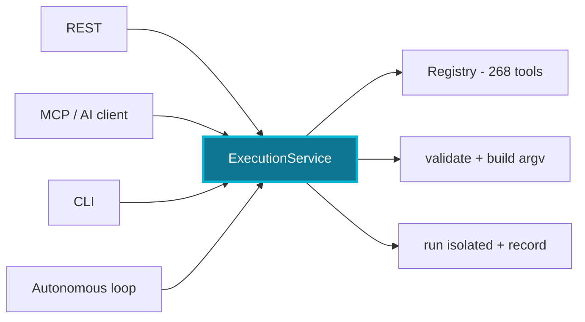

# NexHunter

<div align="center">
  

  Tool-Driven AI Security Orchestration

  <p>Safe orchestration of security tools for <em>authorized</em> assessments.</p>

   
</div>

---

> [!WARNING]
> **Only use NexHunter against systems you own or are explicitly authorized to assess.**

---

## What it is

NexHunter orchestrates external security tools through one execution path. It
does not implement scanners — it validates a request, runs it safely in an
isolated workspace, and records what happened.

The distinguishing property: **an AI client is a caller like any other.** It can
propose a tool and its parameters. It cannot propose a command line — except
through `execute_command` and `execute_python_script`, the two explicitly gated freeform
tools (intrusive risk, withheld from autonomous runs), and the autonomous loop
cannot escalate its own risk ceiling.

## Highlights

- **One execution path.** REST, MCP, CLI, and the autonomous loop all walk the
  same code: lookup → typed validation → build argv → isolated run → record.
- **No arbitrary commands.** No tool takes a command parameter — except
  `execute_command`, the one sanctioned free-form channel (intrusive, recorded,
  withheld from autonomy). A regression suite enforces the rest.
- **Bounded autonomy.** The orchestrator's risk ceiling is clamped to `active`;
  intrusive and destructive tools are withheld for human approval.
- **Honest registry.** 268 tools, each tagged with a maturity level that is
  asserted, never guessed — stub tools are labelled `experimental`, not sold as
  working capability.
- **Browser engine.** Selenium-backed page analysis (tech fingerprint, security
  headers, cookies, DOM depth, JS errors), screenshot, network capture, crawl,
  and form discovery — with a stdlib fallback when Selenium is absent.
- **Visual engine.** Pentester-style severity cards, live dashboards, progress
  bars, and spinners for terminal and API consumers (`NO_COLOR` respected).
- **Fast when you want it.** An LRU+TTL result cache and an optional in-process
  `direct` mode cut repeat work; process management lets you watch and stop runs.
- **Finding validation.** CVSS 3.1 scoring is computed from a vector, not
  guessed; the 4-gate exploitability check is answered by whoever reviews the
  finding (AI or human), never invented by NexHunter's own code.
- **Secrets redacted** from parameters, commands, logs, and output.

## How it works



1. **One execution path** — every caller walks the same code: lookup → typed
   validation → build argv → isolated run → record.
2. **The registry** — 268 `ToolSpec`s with typed params, risk, category, and
   maturity; MCP profiles slice it per client.
3. **The loop** — autonomous assessment: profiler evidence → planner → bounded
   by a clamped risk ceiling and a step budget.
4. **The ledger** — observations, inferences, and findings kept separate,
   deduplicated, exported as JSON / MD / HTML / SARIF.
5. **The boundary** — the AI can propose tools and parameters, never a command
   line (except the gated freeform tools); no path to the OS except
   `ExecutionService`.

Full walkthrough with a call trace, sequence diagram, and the can/cannot table:
[docs/how-it-works.md](docs/how-it-works.md).

## Quick start

One-command setup (Linux/macOS/WSL or Windows PowerShell):

```bash
git clone https://github.com/Arseno25/nexhunter.git
cd nexhunter
./setup.sh          # Windows: .\setup.ps1
```

Or manually:

```bash
python -m venv .venv
.venv/bin/pip install -e ".[api,mcp,browser]"
.venv/bin/python -m nexhunter.cli.client doctor   # check the installation
```

Then start the server and, optionally, the MCP bridge:

```bash
python -m nexhunter.api.server --port 8888
python -m nexhunter.api.mcp --server http://127.0.0.1:8888 --profile nexhunter-recon
```

Or run the server in Docker:

```bash
docker compose up --build        # http://localhost:8888
```

NexHunter never installs binaries for you. To pull in the common **defensive**
recon/analysis tools (never offensive ones), review and run the optional helper:

```bash
./scripts/install-defensive-tools.sh --dry-run   # see what it would do
./scripts/install-defensive-tools.sh             # then install
```

## MCP setup

Add to your AI client's config (Claude Desktop, Claude Code, Cursor, VS Code,
Roo Code, OpenCode — see [docs/mcp/](docs/mcp/)). Clients do not inherit your
shell environment, so use the full interpreter path for your OS:

**Linux/macOS**

```json
{
  "mcpServers": {
    "nexhunter": {
      "type": "local",
      "command": "/usr/bin/python3",
      "args": [
        "-m", "nexhunter.api.mcp",
        "--server", "http://127.0.0.1:8888",
        "--profile", "nexhunter-core"
      ],
      "enabled": true,
      "timeout": 600000,
      "alwaysAllow": []
    }
  }
}
```

**Windows** (backslashes must be escaped in JSON)

```json
{
  "mcpServers": {
    "nexhunter": {
      "type": "local",
      "command": "C:\\Python313\\python.exe",
      "args": [
        "-m", "nexhunter.api.mcp",
        "--server", "http://127.0.0.1:8888",
        "--profile", "nexhunter-core"
      ],
      "enabled": true,
      "timeout": 600000,
      "alwaysAllow": []
    }
  }
}
```

**Virtualenv**

Use `/path/to/.venv/bin/python` on Linux/macOS, or `.venv\Scripts\python.exe`
on Windows — same `args` as above, plus the `enabled`, `timeout` and
`alwaysAllow` fields shown in the other examples. If the exact path is wrong,
the client shows no tools; verify by running the command by hand first.

### Profiles

Listing all 268 tools to every client makes for a large payload, a large token
cost, and a model choosing blindly between near-identical tools. A profile
narrows the registry to one job.

| Profile | Tools | Purpose |
|---|---:|---|
| `nexhunter-core` | 17 | Status, findings, executions, passive stable checks only |
| `nexhunter-recon` | 30 | Host discovery, DNS, subdomains, service identification |
| `nexhunter-web` | 45 | Content discovery, injection testing, template scanning, TLS, browser crawl |
| `nexhunter-bugbounty` | 97 | web + api + recon + osint + auth + crypto — one-stop for public bounty programs |
| `nexhunter-api` | 9 | Schema and parameter discovery (arjun), JWT, GraphQL |
| `nexhunter-code` | 18 | Static analysis, secret scanning, dependency review |
| `nexhunter-cloud` | 10 | Read-only cloud posture |
| `nexhunter-container` | 16 | Container and Kubernetes review |
| `nexhunter-forensics` | 31 | Offline artifact, steganography, and binary analysis |
| `nexhunter-osint` | 7 | OSINT: usernames, emails, footprinting, CVE lookup |
| `nexhunter-wireless` | 9 | Wireless recon and assessment (destructive withheld) |
| `nexhunter-privesc` | 7 | Local privilege escalation discovery |
| `nexhunter-payloads` | 4 | Payload generation, C2 integration (never auto-executed) |
| `nexhunter-vulnscan` | 10 | Vulnerability scanners and IDS tooling |
| `nexhunter-mobile` | 8 | APK inspection, decompilation, runtime exploration |
| `nexhunter-ctf` | 101 | All CTF domains: web, crypto, auth/hash-cracking, RE/pwn, forensics, OSINT |
| `nexhunter-full` | 265 | **Default (no `--profile`).** Everything non-destructive, incl. experimental |

Every profile also surfaces the two freeform tools — `execute_command` and
`execute_python_script` (intrusive, withheld from autonomous runs) — since they serve
any engagement; a profile can opt out with `include_freeform_tools=False`.

```bash
nexhunter profiles                          # list them
nexhunter profiles --name nexhunter-web     # see what one exposes
```

No profile lists a destructive tool. Without `--profile`, the bridge exposes
`nexhunter-full`; pass a profile to narrow the payload. Profiles are a usability
control, not a security control — every execution goes through the same typed
validation regardless of which profile surfaced the tool.

### Tool limits

AI clients cap how many MCP tools they load. Rather than bypassing that limit,
NexHunter lets you pick which slice of the registry fits — `--tool-limit N` keeps
the most useful tools (stable maturity first, installed binaries second) and
drops the rest:

```bash
python -m nexhunter.api.mcp --profile nexhunter-full --tool-limit 100
```

The same cap is available via `NEXHUNTER_MCP_TOOL_LIMIT`. A tool that is not
listed to a client is still callable from the server; it just does not consume
the client's tool budget.

## Autonomous assessment

Hand a whole assessment to the orchestrator and it plans, runs, and re-plans as
results arrive — adaptive, but bounded so the AI drives the loop, never the OS.

```bash
curl -X POST http://127.0.0.1:8888/api/autonomous \
     -d '{"target":"https://example.com","risk_ceiling":"active"}'
```

Or over MCP: *"Run an autonomous assessment of example.com."*

Plan-first over MCP (the AI proposes, the registry and ceiling filter):

```bash
curl -X POST http://127.0.0.1:8888/api/plan \
     -d '{"target":"https://example.com","risk_ceiling":"active",
          "steps":[{"tool":"nmap_scan","params":{"target":"example.com"}}]}'
```

`propose_plan` validates the AI's steps *without executing anything* and returns
`approved`, `withheld`, and `invalid` lists; the approved list is passed back via
`autonomous_assess(steps=...)`, where every step is re-validated before it runs.
The AI writes the plan; the registry and the ceiling filter it.

Two bounds the AI cannot lift:

- **Risk ceiling.** It runs passive and active tools. Intrusive and destructive
  tools are never auto-run — they are surfaced with a reason for human approval.
  A higher ceiling requested is clamped to `active`, not granted.
- **Step budget.** It stops after a set number of steps.

Every step goes through the same `ExecutionService` as a manual call, so the loop
cannot reach the OS any other way.

## Finding validation

A tool observation and a confirmed, submission-ready vulnerability are
different claims. Two tools sit between them, both callable by any MCP
client (or plain REST) — neither invents a value the caller didn't establish:

```bash
curl -X POST http://127.0.0.1:8888/api/cvss/score \
     -d '{"vector":"CVSS:3.1/AV:N/AC:L/PR:N/UI:N/S:U/C:H/I:H/A:H"}'
# {"ok":true,"vector":"CVSS:3.1/...","base_score":9.8,"severity":"critical"}

curl -X POST http://127.0.0.1:8888/api/findings/<id>/gates \
     -d '{"refutation":"pass","reachability":"pass","trigger":"pass","impact":"pass"}'
```

- **CVSS 3.1 scoring** is the official base-score formula over a vector
  string — pure arithmetic, not a guess. A `Finding.cvss_vector` recomputes
  `cvss_score` from it and raises `severity` to match, but never lowers a
  severity already set higher. A malformed vector is rejected, not silently
  dropped to a default.
- **The 4-gate validator** (refutation → reachability → trigger → impact)
  answers a question no tool output can settle on its own: is this actually
  exploitable? That's a reasoning task, so NexHunter's code never answers it
  — an AI client (or a human) reviews the finding via `get_finding` and
  submits its own verdict per gate through `submit_finding_gates`. The code's
  job is only the deterministic part: validating the four verdicts and
  aggregating them (`refuted` on any `fail`; `demoted` on any `demote` with
  no `fail` — clears, but under a caveat that argues for lower severity;
  `needs_review` on `unsure` with neither; `confirmed` when all four `pass`
  cleanly). A gate verdict, once recorded, survives a repeat tool sighting —
  merging a rerun never resets a review.
- **Submission-ready reports.** `bounty_report(finding_id, platform)` (or
  `POST /api/findings/{id}/report`) renders one finding for HackerOne,
  Bugcrowd, Intigriti, Immunefi, or a generic format. An unreviewed or
  refuted finding still renders — with a warning banner, not silence. Impact
  narrative comes from the reviewer's own `submit_finding_gates` reasoning,
  never invented from evidence that doesn't describe one; Immunefi's
  fund-loss-based severity category is explicitly left for a human to pick
  rather than faked from a CVSS score that measures something else.
- **Confidence-scored reports.** `submit_finding_gates` optionally takes
  named deduction flags (partial attack path, bounded impact, requires a
  specific state, requires user interaction, fix partially mitigates); each
  present flag costs a fixed number of points off 100. A report at ≥ 80
  renders in full, 60–79 keeps the PoC but withholds remediation, and below
  60 renders as a lead only — no PoC, no remediation — rather than dressing
  an unconfirmed finding up as submission-ready. Unscored (the default)
  always renders in full: this is opt-in, not a penalty for skipping it.
- **`nexhunter://findings/patterns`** is a curated reference of bug classes
  bug bounty programs reject on sight (open redirect alone, self-XSS,
  missing security headers alone, …) and patterns that look alarming but are
  widely treated as by-design. It's read-only knowledge for an AI to consult
  before gate review, never an auto-filter — matching a title against a
  string is not proof a finding lacks the chain that makes it valid.
- **The whole flow is one MCP prompt.** `bugbounty_hunt(target)` is an MCP
  *prompt* (the protocol's own primitive for a reusable skill/workflow
  template) — recon → probe/scan → explore → the 4-gate check → score &
  report, phase by phase. Any MCP client discovers it automatically on
  connect via the standard prompt-listing capability the protocol already
  requires, so there's nothing extra to install or paste into a system
  prompt beyond the one MCP server entry every client needs anyway — and
  because it's an open, multi-vendor protocol (not a Claude-only Skill
  file), it works the same way for any MCP-speaking AI or provider. The
  tool list per phase is generated from the live registry every time the
  prompt renders, never hardcoded, so it can't drift out of sync with
  what's actually installed.

## Execution modes

Both modes share the registry, typed validation, redaction, and the risk
ceiling — they differ only in what they leave behind.

| Mode | Record & workspace | Cache | Use for |
|---|---|---|---|
| **recorded** (default) | Full `ExecutionRecord`, isolated workspace, history, terminable | ✓ | Assessments you want to audit and revisit |
| **direct** (`direct: true`) | None — validate → build → run → return, in-process | ✓ | Fast, throwaway calls where a history entry is noise |

Both cache deterministic terminal results (`completed`/`failed`); a timeout or
termination is never cached. Set `no_cache: true` to force a fresh run.

### Browser engine

One endpoint, five modes — Selenium (headless Chrome) when installed, stdlib
fallback otherwise:

```bash
curl -X POST http://127.0.0.1:8888/api/browser/analyze \
     -d '{"url":"http://example.com"}'                    # full page analysis
curl -X POST http://127.0.0.1:8888/api/browser/screenshot -d '{"url":"http://example.com"}'
curl -X POST http://127.0.0.1:8888/api/browser/network    -d '{"url":"http://example.com"}'
curl -X POST http://127.0.0.1:8888/api/browser/crawl      -d '{"url":"http://example.com"}'
curl -X POST http://127.0.0.1:8888/api/browser/forms      -d '{"url":"http://example.com"}'
```

`analyze` returns title, HTTP status, tech fingerprint (Cloudflare, jQuery, …),
nine security-header checks, cookie flags (Secure/HttpOnly/SameSite), DOM depth,
JS errors, and console warnings. The Selenium path disables
`AutomationControlled` and injects an anti-detection script; without Selenium it
degrades to a static fetch and says so in `note`. Network capture uses the
Performance API, so no CDP dependency. Screenshots land in
`browser_screenshot.png`.

### Visual engine

High-fidelity terminal rendering with ANSI, auto-degrading to ASCII on
encodings without box-drawing glyphs (e.g. Windows cp1252) and to plain text
with `NO_COLOR`:

```bash
curl -X POST http://127.0.0.1:8888/api/visual/card \
     -d '{"title":"SQLi","severity":"high","description":"...","remediation":"..."}'
curl http://127.0.0.1:8888/api/visual/dashboard    # live request/finding counts
```

`/api/visual/card` returns a typed `VulnerabilityCard` (id, severity, confidence,
cvss, poc, remediation, timestamp) that `VulnerabilityCard.to_cli()` renders as a
bordered card colored by severity. The same functions power the CLI's live
progress bars and the MCP `vulnerability_card` / `dashboard` tools.

### Caching & process management

- `GET /api/cache/stats` — hits, misses, evictions, hit rate.
- `POST /api/cache/clear` — drop every cached result.
- `GET /api/processes/list` — executions currently running, with live pid.
- `GET /api/processes/status/{pid}` — status of one running process.
- `POST /api/processes/terminate/{pid}` — stop it through the same cancel path
  that `terminate` uses (ends in `terminated`, never a raw kill).

## Security model

Enforced and covered by tests:

- **No arbitrary command execution.** No tool takes a command parameter and no
  builder splits a string into argv — the one exception is `execute_command`,
  whose entire parameter is the command, gated as intrusive (never
  auto-executed) and executed through the OS shell only there.
- **Typed validation.** Every parameter declares a type, a default, and a
  validation rule; a value that is not a valid target, port, or enum is refused
  before a command is ever built.
- **Bounded autonomy.** The orchestrator's ceiling is clamped to `active`;
  intrusive and destructive tools are withheld, and destructive tools
  additionally require a feature flag.
- **Offensive agents are opt-in.** Agents that would reach the network outside
  the execution gate are refused by the API unless
  `NEXHUNTER_INTRUSIVE_TOOLS_ENABLED` is set — consistent with the tool ceiling.
- **Contained execution.** Isolated workspace per run, timeouts that kill the
  whole process tree, output caps, no path traversal or symlink escape.
- **Secrets redacted** from parameters, commands, logs, and output.
- **One execution path.** REST, MCP, and CLI cannot diverge.

Full detail, and an explicit list of what is *not* guaranteed, in
[docs/security-model.md](docs/security-model.md).

## CLI

```bash
nexhunter doctor                              # environment health check
nexhunter registry list --category recon      # browse the registry
nexhunter registry check                      # which binaries are installed
nexhunter registry info nmap_scan             # describe one tool
nexhunter profiles                            # MCP profiles
```

`doctor` reports what is true about your environment and never changes it:

```
NexHunter Doctor

Core
  [OK] Python 3.13.7
  [OK] Windows 11
  [OK] Data directory writable: ./nexhunter_data
  [OK] Server binds to loopback (127.0.0.1)
  [OK] fastmcp available (MCP server)
  [OK] defusedxml available (safe XML parsing)
  [OK] Process execution works

Security
  [OK] Raw command execution disabled (registry tools only)
  [OK] Shell execution only via the execute_command builder contract
  [OK] Destructive tools disabled
  [OK] Intrusive tools disabled

Stable tools (8/29 installed)
  [OK] nmap_scan (nmap)
  [OK] curl_headers (curl)
  [MISSING] 21 other stable tools not installed (--all to list)

Registry availability (38/268 tools on PATH)
  [OK] web: 8/38 available
  [MISSING] network: 0/21 available
```

Your numbers differ — this is a health check of *your* machine, not a
specification. No failures and no warnings is a healthy install.

NexHunter never installs binaries for you.

## REST API

```bash
curl -X POST http://127.0.0.1:8888/api/command \
     -d '{"tool": "nmap_scan", "params": {"target": "example.com", "ports": "80,443"}}'
```

| Endpoint | Purpose |
|---|---|
| `GET /health` `/ready` `/version` | Server status |
| `GET /api/tools` | Registry, filterable by category, risk, maturity, availability |
| `GET /api/tools/{name}` | One tool's metadata |
| `GET /api/tools/status` | What is installed |
| `POST /api/command` | Run a registered tool (`async`, `no_cache`, `direct` supported) |
| `GET /api/executions` | Execution history with status |
| `GET /api/executions/{id}/output` | Captured output, redacted |
| `GET /api/executions/{id}/artifacts` | Artifacts in that execution's workspace |
| `POST /api/executions/{id}/terminate` | Stop a running execution and its children |
| `POST /api/autonomous` · `GET /api/autonomous[/{id}]` | Start / poll an adaptive run |
| `GET /api/findings` | Findings |
| `GET /api/findings/{id}` | One finding, full evidence |
| `POST /api/findings/{id}/gates` | Record a reviewed 4-gate verdict (refutation/reachability/trigger/impact) |
| `POST /api/findings/{id}/report` | Submission-ready report for a platform: hackerone/bugcrowd/intigriti/immunefi/generic |
| `POST /api/cvss/score` | CVSS 3.1 base score from a vector string |
| `GET /api/mcp/profiles` | Profile definitions |
| `GET /api/cache/stats` · `POST /api/cache/clear` | Result-cache telemetry / reset |
| `GET /api/processes/list` · `/status/{pid}` · `POST /terminate/{pid}` | Live process management |
| `POST /api/browser/{mode}` | Browser engine: `analyze` `screenshot` `network` `crawl` `forms` |
| `POST /api/visual/card` · `GET /api/visual/dashboard` | Vulnerability card / live dashboard |
| `POST /api/plan` · `POST /api/attack-chain` | Plan-first autonomy · multi-step attack chains |
| `POST /api/sandbox/validate` · `/execute` · `/cleanup` | Validate + run tool code in an isolated workspace |
| `POST /api/web-lab/*` | HTTP lab: packet capture, replay, proxy |
| `GET /api/agents` · `POST /api/agents/{name}` | Agent inventory / single agent execution |
| `POST /api/intelligence/analyze-target` | AI analysis: tech fingerprint, CVE lookup, tool selection |
| `POST /api/findings/export` | Ledger export: JSON / MD / HTML / SARIF |

The server binds to `127.0.0.1` by default and `doctor` fails loudly on any
other binding unless `NEXHUNTER_EXTERNAL_BIND_ALLOWED` is set.

## Tool registry & maturity

268 tools across 21 categories. Maturity is asserted per tool, never guessed.

| Level | Meaning | Count |
|---|---:|---:|
| **stable** | Command builder, availability check, parser (where applicable), tests | 29 |
| **beta** | Registered and validated, less exercised | 217 |
| **experimental** | Registered but not honestly usable as written (placeholder binary or hardcoded stand-in args); kept out of the focused profiles | 22 |

Risk levels: 59 passive · 168 active · 38 intrusive · 3 destructive. Cloud,
container, and orchestration access is exposed as fixed read-only actions
(`aws_get_caller_identity`, `kubectl_get_pods`, `docker_list_containers`), never
as a CLI passthrough.

## Configuration

```bash
NEXHUNTER_ENVIRONMENT=development            # production refuses destructive tools
NEXHUNTER_BIND_HOST=127.0.0.1
NEXHUNTER_BIND_PORT=8888
NEXHUNTER_EXTERNAL_BIND_ALLOWED=false
NEXHUNTER_DATA_DIR=./nexhunter_data
NEXHUNTER_MCP_PROFILE=nexhunter-full
NEXHUNTER_DESTRUCTIVE_TOOLS_ENABLED=false
NEXHUNTER_INTRUSIVE_TOOLS_ENABLED=false      # also gates offensive agents
NEXHUNTER_CACHE_ENABLED=true                 # cache deterministic tool results
NEXHUNTER_CACHE_TTL=300                       # seconds; 0 disables expiry
NEXHUNTER_CACHE_MAX_ENTRIES=256
```

See [.env.example](.env.example).

## Testing

```bash
pytest                                                    # 358 tests, all passing
pytest --cov=nexhunter --cov-report=term-missing          # coverage
ruff check .                                              # zero lint errors
mypy --explicit-package-bases .                           # zero type errors
```

The CI matrix runs Python 3.10–3.13 on Ubuntu and Windows with the same
commands. MCP profile filtering (`--profile`/`--tool-limit`) works on both
FastMCP 2.x and 3.x — the tool-removal path tries both internal layouts
(`_tool_manager._tools` on 2.x, `local_provider._tools` on 3.x) instead of a
public API neither version fully exposes.

Coverage is measured, not claimed. The execution and findings layers are the
best covered; legacy agent and engine code is thinner.

## Limitations

- Not a sandbox. Tools run with the server process's privileges.
- The server does not authenticate callers; bind to loopback or put something
  authenticated in front of the port.
- Redaction is pattern-based and may miss unusual credential formats.

## Roadmap

- Mature more beta tools to stable (parser + fixture + test), category by category.
- Migrate legacy `Engine` flows (`/api/probe`, `/api/portscan`) onto `ExecutionService`.
- Raise coverage on `api/server.py`, `core/engine.py`, and `agents/`.
- Browser engine: live network interception (mitmproxy/CDP) instead of the
  post-hoc Performance API capture.

## Documentation

| Document | Contents |
|---|---|
| [docs/architecture.md](docs/architecture.md) | Layers, execution flow, state machine, diagrams |
| [docs/security-model.md](docs/security-model.md) | Threat model, guarantees, non-guarantees |
| [docs/how-it-works.md](docs/how-it-works.md) | One execution path, call trace, the loop, the can/cannot boundary |
| [docs/workflows.md](docs/workflows.md) | Phased tool-execution sequences, how a workflow stays within scope |
| [docs/mcp/](docs/mcp/) | MCP setup per client |

## Contributing

Adding a tool means adding a `ToolSpec` with a command builder that takes
discrete values — never a command string. Maturing one to `stable` means giving
it a parser and a test. See [docs/architecture.md](docs/architecture.md); the
regression suite in `tests/test_no_passthrough.py` will reject a passthrough.

## License

[MIT](LICENSE) — Copyright (c) 2026 Arseno25.

---

<div align="center">
<strong>NexHunter v1.0.0</strong> — Tool-Driven AI Security Orchestration<br>
<a href="https://github.com/Arseno25/nexhunter">GitHub</a>
</div>
