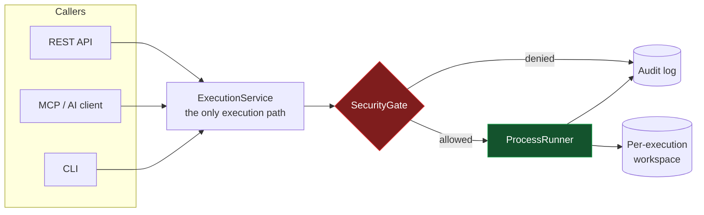
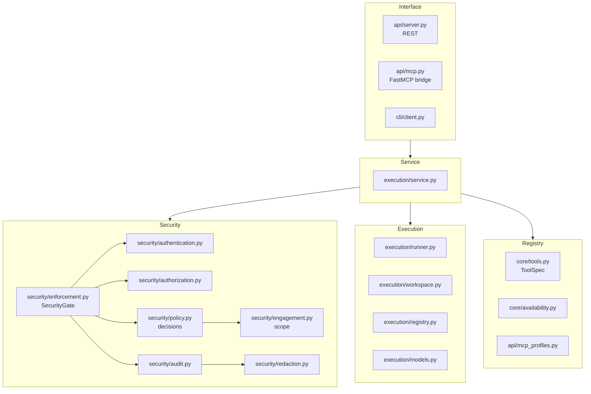
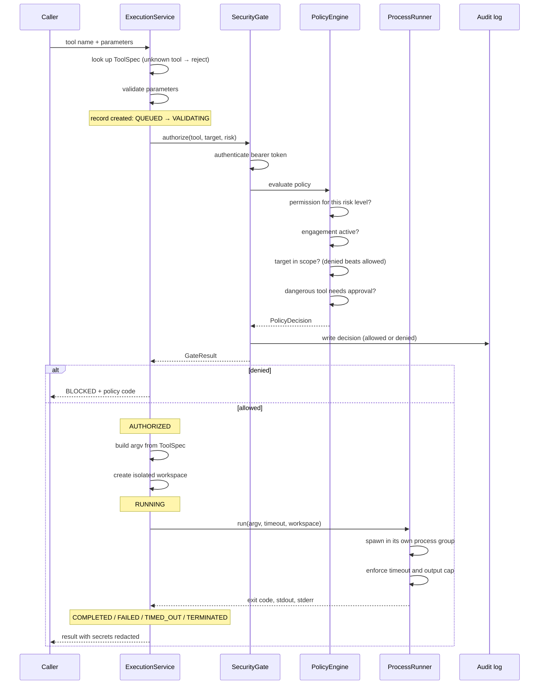
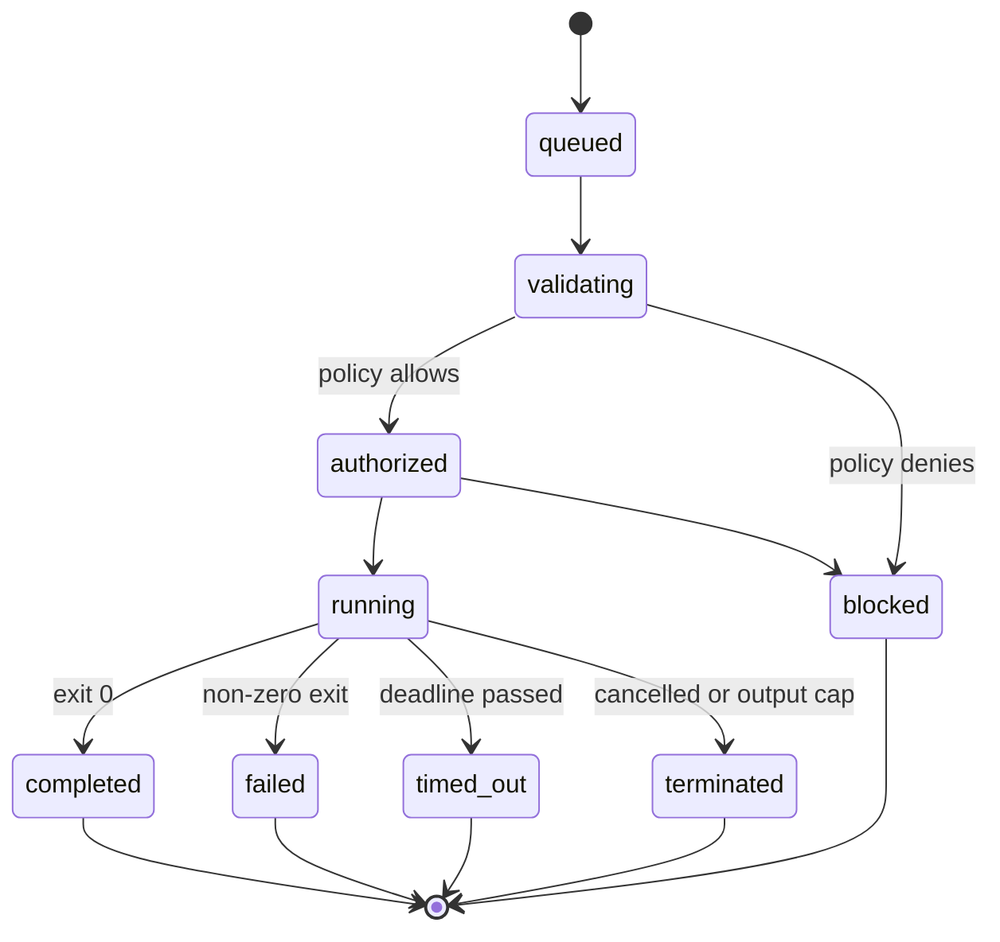
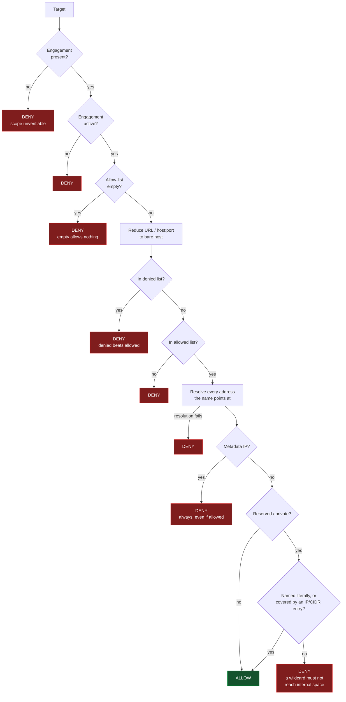
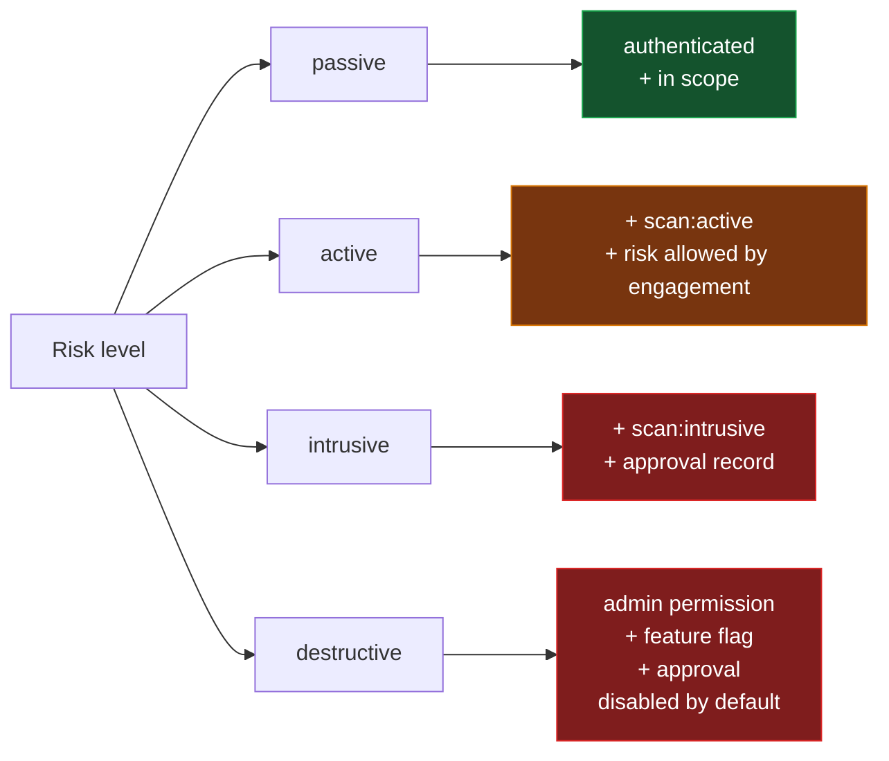
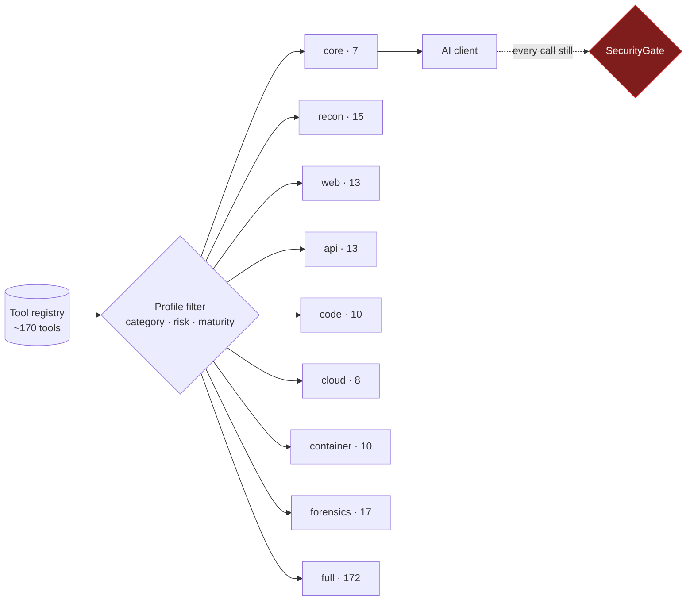

# Architecture

NexHunter is a policy-driven orchestration layer over external security tools.
It does not implement scanners; it decides whether a scan may run, runs it
safely, and records what happened.

> Only use NexHunter against systems you own or are explicitly authorized to assess.

## The one rule

Every execution — from the REST API, from an AI client over MCP, from the CLI —
goes through the same gate. There is no second path.



An AI client is a caller like any other. It can propose a tool and parameters;
it cannot propose a command, widen its own scope, or overrule the policy engine.

## Layers



| Layer | Responsibility | Must not |
|---|---|---|
| Interface | Parse requests, shape responses | Build commands, spawn processes, decide policy |
| Service | Sequence validate → authorize → run → record | Contain tool-specific logic |
| Security | Decide who may run what, against which targets | Be bypassable by any caller |
| Execution | Run a process safely and contain its output | Decide whether it should run |
| Registry | Describe tools and their parameters | Execute anything |

## What happens on one execution



## Execution states

A record moves through an explicit state machine. Illegal transitions raise
rather than silently corrupting the record, so a blocked execution can never
appear to have run.



## Scope enforcement

Target validation is the part most worth understanding, because it is where an
authorized assessment stops being authorized. It fails closed at every step.



Resolving the name is what stops DNS rebinding: a host that passes the
name-based check but points at `169.254.169.254` or `10.0.0.5` is still denied.

## Policy decisions



Credential attacks, brute force, payload generation, exploitation, persistence,
data modification, denial of service, wireless deauthentication, and destructive
cloud actions never run automatically. They require an explicit approval record.

## MCP profiles

The bridge decides what a client is *shown*. The server decides what is
*allowed*. Hiding a tool is a usability choice, not a security control.



The default profile exposes 7 tools rather than 172, which cuts initialization
payload and token cost and stops a model choosing blindly between near-identical
tools.

## Artifact containment

```
NEXHUNTER_DATA_DIR/
└── engagements/
    └── <engagement_id>/
        └── executions/
            └── <execution_id>/
                ├── stdout.log
                ├── stderr.log
                └── <tool artifacts>
```

Identifiers and artifact names are validated against a strict pattern, paths are
canonicalized, and symlinks are resolved before the containment check. There is
no general file-manager API: artifacts are reachable only by name, only within
one execution's workspace.

## Deliberate non-goals

- **No autonomy.** NexHunter does not decide to attack anything. A model
  proposes; the policy engine disposes.
- **No arbitrary command execution.** No parameter carries a command line, no
  builder splits a string into argv, no path uses a shell.
- **No binary installation.** Missing tools are reported, never fetched.
- **No offensive capability added.** Tools that only make sense for attack (C2
  frameworks) are not registered.

## Module map

| Path | Contents |
|---|---|
| `security/authentication.py` | Bearer tokens, constant-time comparison |
| `security/authorization.py` | Permissions and roles |
| `security/engagement.py` | Engagement model, target validation, DNS checks |
| `security/policy.py` | Deterministic execution decisions |
| `security/redaction.py` | Secret detection for logs, records, output |
| `security/audit.py` | Structured JSON audit log |
| `security/enforcement.py` | SecurityGate: ties the above together |
| `execution/models.py` | ExecutionRecord and its state machine |
| `execution/workspace.py` | Per-execution isolated directories |
| `execution/runner.py` | Process spawning, tree termination, output caps |
| `execution/registry.py` | Concurrency-safe, bounded record store |
| `execution/service.py` | The single execution path |
| `core/tools.py` | ToolSpec registry and command builders |
| `core/availability.py` | Binary presence and version detection |
| `api/mcp_profiles.py` | Profile definitions and filtering |
| `cli/doctor.py` | Environment health check |

## Related

- [security-model.md](security-model.md) — threat model and guarantees
- [mcp/README.md](mcp/README.md) — MCP setup and client configuration
- [HEXSTRIKE_COMPARISON.md](HEXSTRIKE_COMPARISON.md) — comparison with HexStrike AI
