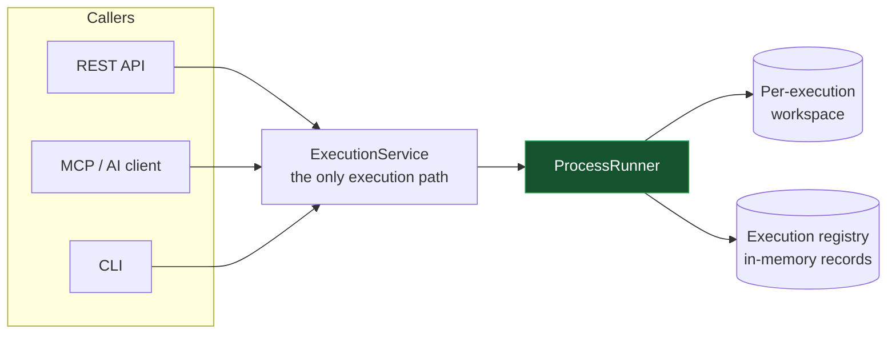
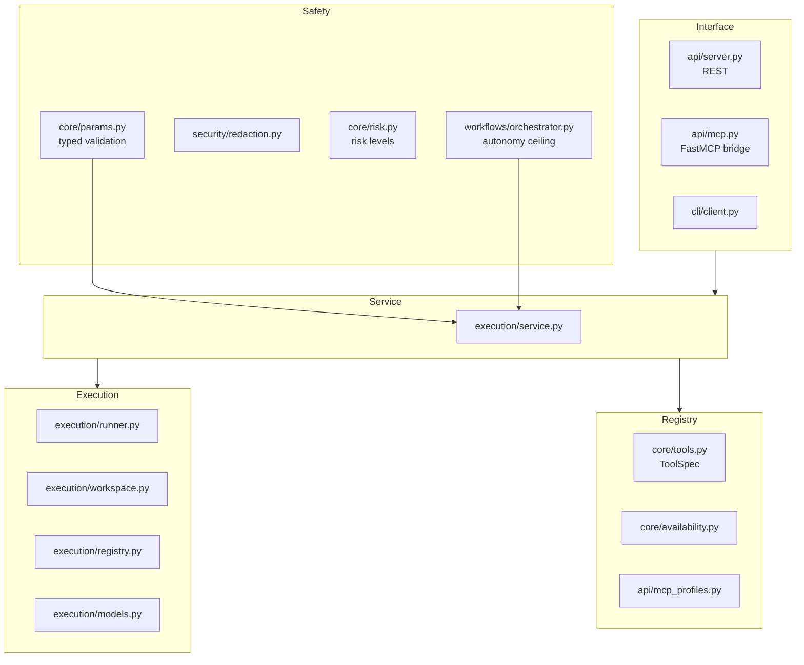
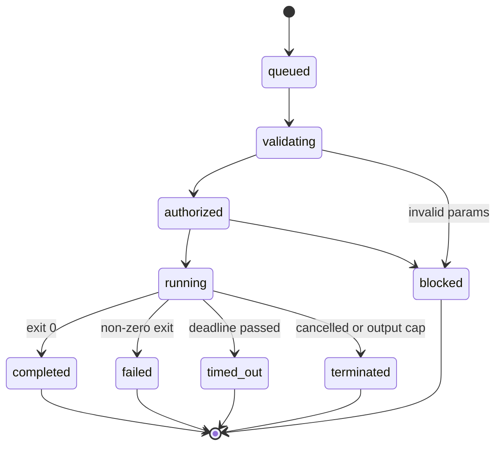
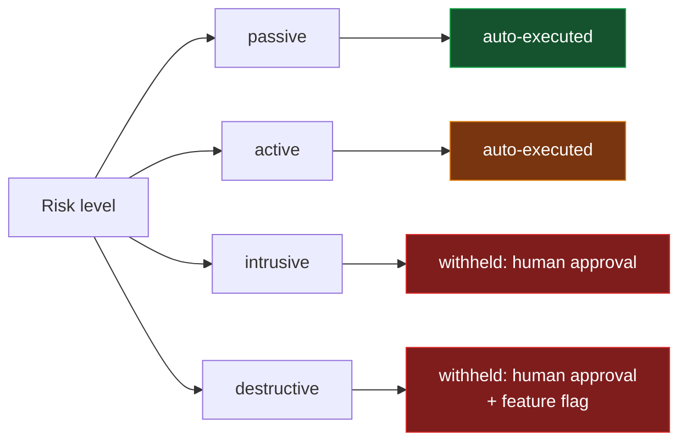
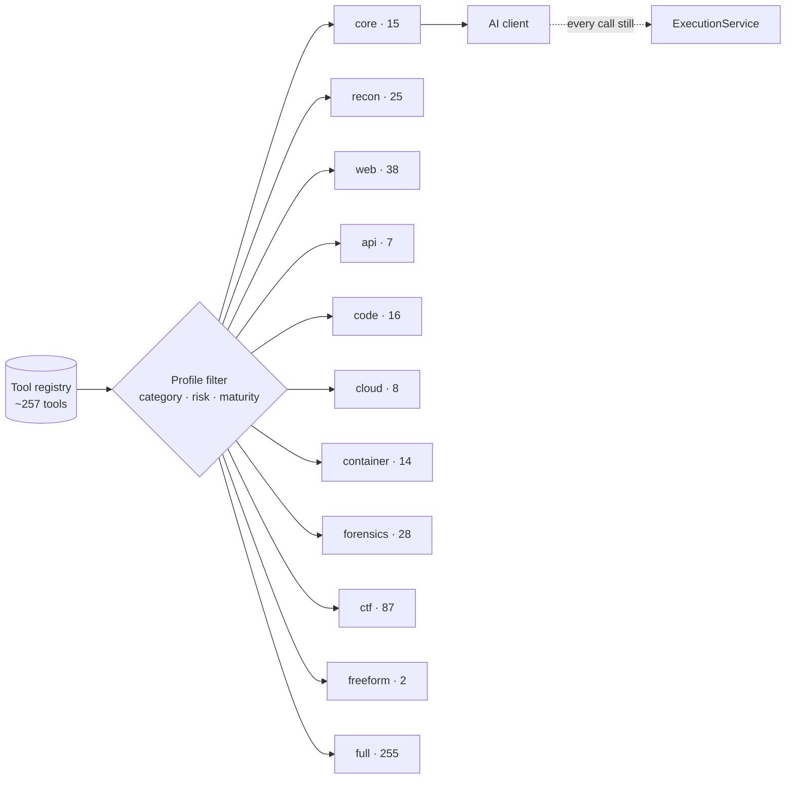

# Architecture

NexHunter is an orchestration layer over external security tools. It does not
implement scanners; it validates what a scan may run, runs it safely in an
isolated workspace, and records what happened.

> Only use NexHunter against systems you own or are explicitly authorized to assess.

## The one rule

Every execution — from the REST API, from an AI client over MCP, from the CLI —
goes through the same service. There is no second path.



An AI client is a caller like any other. It can propose a tool and parameters;
it cannot propose a command line — except through the two gated freeform tools
(`shell_command`, `python_script`), which are intrusive, recorded, and withheld
from autonomous runs. The autonomous orchestrator sits on top of the same
service and may only execute what its risk ceiling permits.

## Layers



| Layer | Responsibility | Must not |
|---|---|---|
| Interface | Parse requests, shape responses | Build commands, spawn processes |
| Service | Validate → run → record, redacted | Contain tool-specific logic |
| Safety | Validate input shape, redact secrets, set autonomy ceilings | Be bypassable by any caller |
| Execution | Run a process safely and contain its output | Decide whether it should run |
| Registry | Describe tools and their parameters | Execute anything |

## What happens on one execution

```mermaid
sequenceDiagram
    participant C as Caller
    participant S as ExecutionService
    participant R as ProcessRunner
    participant W as Workspace

    C->>S: tool name + parameters
    S->>S: look up ToolSpec (unknown tool → reject)
    S->>S: validate parameters (typed, secret-aware)
    Note over S: record created: QUEUED → VALIDATING

    S->>S: build argv from ToolSpec (argv-only; shell only via the sanctioned shell_command flag)
    S->>S: redact secrets from params and command
    S->>S: create isolated workspace
    Note over S: AUTHORIZED → RUNNING
    S->>R: run(argv, timeout, workdir)
    R->>R: spawn in its own process group
    R->>R: enforce timeout and output cap
    R-->>S: exit code, stdout, stderr
    Note over S: COMPLETED / FAILED / TIMED_OUT / TERMINATED
    S-->>C: result with secrets redacted
```

## Execution states

A record moves through an explicit state machine. Illegal transitions raise
rather than silently corrupting the record, so a failed execution can never
appear to have run.



## Input safety

Execution safety lives in the parameter contract, not in a policy layer:

- **Typed validation.** Every parameter declares a type, a default, and a
  validation rule (`core/params.py`). A value that is not a valid target, port,
  or enum is refused before a command is ever built.
- **No passthrough.** No parameter carries a command line, no builder splits a
  string into argv, and no execution path uses a shell — except the one
  sanctioned flag on `shell_command`, whose entire parameter is the command
  (intrusive, uncacheable, withheld from autonomy). Any other free-form command
  parameter is an arbitrary-command API and is a regression test failure.
- **Secret redaction.** Parameters whose names match secret patterns are
  redacted in records, logs, and responses (`security/redaction.py`).
- **Artifact containment.** Workspaces live under `NEXHUNTER_DATA_DIR/executions/
  <execution_id>/`. Identifiers and artifact names are validated against a
  strict pattern, paths are canonicalized, and symlinks are resolved before the
  containment check. There is no general file-manager API: artifacts are
  reachable only by name, only within one execution's workspace.

## Risk ceiling for autonomy

The autonomous orchestrator (`workflows/orchestrator.py`) plans steps from the
target profile and executes them through the same `ExecutionService`. It is
bounded by a risk ceiling:



The ceiling is clamped to `active` regardless of what a caller requests:
intrusive and destructive tools are never auto-executed. Credential attacks,
brute force, exploitation, persistence, and destructive actions are always
withheld and require an explicit decision to run them as a standalone,
approved step.

## MCP profiles

The bridge decides what a client is *shown*. The service decides what is
*valid*. Hiding a tool is a usability choice, not a security control.



Seven more specialty profiles (osint, wireless, privesc, payloads, vulnscan,
mobile, freeform) slice the same registry the same way; the full list with
counts is in the README.

Without a `--profile` flag the bridge defaults to `nexhunter-full` (255 tools,
everything non-destructive). A focused profile cuts initialization payload and
token cost and stops a model choosing blindly between near-identical tools —
`nexhunter-core`, for example, exposes 15 passive stable checks. The freeform
profile is the deliberate HexStrike-style escape hatch: exactly
`shell_command` and `python_script`, intrusive and never auto-executed.

## Artifact containment

```
NEXHUNTER_DATA_DIR/
└── executions/
    └── <execution_id>/
        ├── stdout.log
        ├── stderr.log
        └── <tool artifacts>
```

## Result caching and live processes

Both sit on the one execution path and add no way to reach the OS.

- **Result cache** (`execution/cache.py`). Keyed by the tool name and its
  *normalized* parameters, it stores only deterministic terminal outcomes
  (completed or failed); a timeout or termination is never cached. A hit returns
  the original execution's result with `cached: true` and mints no new record,
  so the state machine is never asked for an illegal jump. Values are hashed
  into the key, so no parameter — secret or otherwise — is recoverable from it.
  `no_cache` on a request forces a fresh run.
- **Live processes.** A "process" is just an execution in `running` state that
  has been assigned an OS pid (recorded the moment the child spawns). There is
  no separate process table and no second way to spawn or kill: terminating by
  pid resolves to the owning execution and goes through the same cancellation
  path as `terminate`, ending in `terminated` — never a raw `kill`.

## Deliberate non-goals

- **No autonomous attack decisions.** Intrusive and destructive actions are
  withheld by the orchestrator's risk ceiling; autonomy is bounded to passive
  and active steps.
- **No arbitrary command execution.** No parameter carries a command line and
  no builder splits a string into argv. The sole exception is `shell_command`:
  its parameter is the entire command, and it executes through the OS shell —
  gated as intrusive (never auto-executed by the orchestrator), uncacheable,
  recorded, and withheld from default profiles.
- **No binary installation.** Missing tools are reported, never fetched.
- **No off-the-shelf attack automation.** Attack-only tools (payload
  generation, C2 integration, freeform execution) are registered but confined
  to the `payloads` and `freeform` profiles: gated by
  `NEXHUNTER_INTRUSIVE_TOOLS_ENABLED`, never auto-executed by the
  orchestrator, and never surfaced by default profiles.

## Module map

| Path | Contents |
|---|---|
| `api/server.py` | REST interface (Flask); the only external entry to the service |
| `api/mcp.py` | FastMCP bridge with profile filtering and tool limits |
| `api/visual.py` | Vulnerability cards, dashboards, progress bars (ANSI/ASCII) |
| `agents/browser.py` | Selenium page analysis with stdlib fallback |
| `execution/models.py` | ExecutionRecord and its state machine |
| `execution/workspace.py` | Per-execution isolated directories |
| `execution/runner.py` | Process spawning, tree termination, output caps |
| `execution/registry.py` | Concurrency-safe, bounded record store |
| `execution/cache.py` | LRU+TTL cache of deterministic terminal results |
| `execution/service.py` | The single execution path |
| `core/params.py` | Typed parameter validation and secret naming |
| `core/risk.py` | Risk levels shared by registry and orchestrator |
| `core/tools.py` | ToolSpec registry and command builders |
| `core/availability.py` | Binary presence and version detection |
| `security/redaction.py` | Secret detection for logs, records, output |
| `workflows/orchestrator.py` | Adaptive planner and bounded autonomy loop |
| `api/mcp_profiles.py` | Profile definitions and filtering |
| `cli/doctor.py` | Environment health check |

## Related

- [security-model.md](security-model.md) — threat model and guarantees
- [mcp/README.md](mcp/README.md) — MCP setup and client configuration
- [how-it-works.md](how-it-works.md) — one execution path, the loop, the boundary
