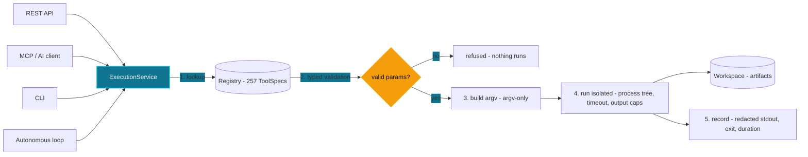
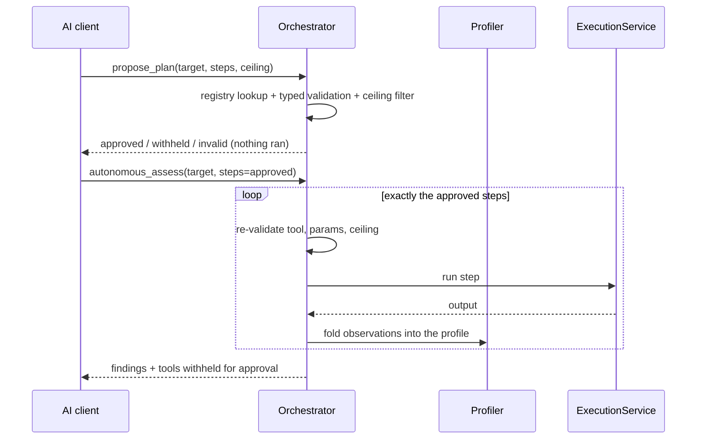

# How It Works

NexHunter's idea fits in one sentence:

> **Every request — from an AI client, REST, the CLI, or the autonomous loop —
> is the same request.**

There is one execution path, one registry, and one record of what happened.
Nothing else exists to diverge from them.

> Only use NexHunter against systems you own or are explicitly authorized to assess.

## The spine: one execution path



The diagram is not an abstraction: it is every call. `POST /api/command`, an MCP
tool invocation, a CLI run, and each step of the autonomous loop all walk the
exact same code. Follow one call, and you have followed them all.

## Trace of one call

`nmap_scan` against `scanme.example.com`:

| Step | What happens |
|---|---|
| 1. Lookup | The name must be in the registry; anything else is `unknown tool`. |
| 2. Validate | `target` must be a valid hostname — a value like `; rm -rf /` or `$(curl evil)` is refused as an invalid target before any command exists. |
| 3. Build | The registry's builder emits a fixed argv: `["nmap", "-sV", "-p", "80,443", "scanme.example.com"]`. No shell, no strings, no free-text — except `shell_command`, whose single string runs through the OS shell as its entire payload. |
| 4. Run | Spawned in an isolated workspace with a timeout that kills the whole process tree; stdout is capped. |
| 5. Record | Exit code, duration, redacted output, and any artifacts are stored under that execution's ID. |

The parameters the caller sent and the argv that ran are different things, and
only the builder — project code, never model output — can produce the second.

## The registry: 257 tools, one shape

Every tool is a `ToolSpec` with the same anatomy:

| Field | Meaning |
|---|---|
| `params` → `param_specs` | Typed schemas: type, default, validation rule. Refused server-side if violated. |
| `risk_level` | `passive` / `active` / `intrusive` / `destructive`. The ceiling keys off this. |
| `category` | One of 20 categories. Drives which MCP profile surfaces the tool. |
| `maturity` | `stable` (parser + fixture + test), `beta` (registered, less exercised), or `experimental` (registered but not honestly usable as written). |
| `available` | Whether the binary exists on this host — checked with `shutil.which`, never guessed. |
| `builder` | The only place a command line can come into being. Returns an argv list by default, or a `ShellCommand` (a str subclass) when the whole payload must run through the OS shell — used by exactly one tool, `shell_command`. |

Profiles are slices over these fields: `nexhunter-ctf` asks for eight
categories, `nexhunter-osint` asks for the `osint` category, `nexhunter-core`
asks for stable, passive tools only. Without a `--profile` flag the bridge
defaults to `nexhunter-full` — the whole non-destructive registry. A client is
shown the slice for its job when one is chosen; with the default it sees
everything.

### Fine-grained variants: `*_advanced_scan`

Three registered tools expose scan tuning as discrete typed parameters instead
of a free-form command line — the same no-passthrough contract as everything
else in the registry (freeform execution lives in `shell_command` and
`python_script`, the two sanctioned exceptions, surfaced by every profile):

| Tool | Added knobs (all typed) | Output |
|---|---|---|
| `nmap_advanced_scan` | `os_detection`, `version_detection`, `aggressive`, `stealth`, `nse_scripts`, `ports`, `timing` | `-oX -` parsed by the `nmap_xml` parser |
| `masscan_advanced_scan` | `rate`, `threads`, `ports` | `-oG -` parsed by the new `masscan_grep` parser |
| `ffuf_advanced_scan` | `wordlists` (comma-separated, one `-w` each), `method`, `filter_status`, `matcher_status`, `threads` | silent mode |

There is deliberately no `--additional-args` passthrough: each flag is a named
boolean/integer/string parameter validated server-side, so the builder output
stays a fixed argv in every case.

## The loop: autonomous assessment



There are two ways to run:

- **Plan-first (the AI's own plan).** `propose_plan` takes the AI's proposed
  steps and validates them *without executing anything*: registry lookup,
  typed parameter validation, and a risk check against the ceiling. It returns
  three lists — `approved`, `withheld` (valid but intrusive/destructive,
  needs a human), `invalid` (unknown tool or bad parameters). The approved
  list goes back into `autonomous_assess(steps=...)`, where every step is
  validated a second time before it runs. The AI writes the plan; the registry
  and the ceiling filter it.
- **Evidence-driven (the default).** Without `steps`, the loop below plans
  from what the profiler has observed.

The loop is autonomous but never unsupervised:

- **The planner, not the AI, picks tools.** The profiler accumulates only what
  has been *observed* — resolved addresses, technologies, services — each fact
  tagged with the tool that found it. The planner turns that profile into a
  plan. The same profile yields the same plan: runs are reproducible.
- **The ceiling is not askable.** The loop runs passive and active tools.
  Intrusive and destructive tools — credential attacks, brute force,
  exploitation — are never auto-executed. They are surfaced under
  `recommended_next` with the reason they were withheld, for a human to
  approve. A request for a higher ceiling is clamped to `active`, not granted.
- **The budget is not skippable.** The loop stops after a set number of steps.
- **Every step is a normal call.** Each iteration goes through the same
  `ExecutionService` as step 3 of the trace above. A missing binary mid-run is
  recorded, and the run continues.

Adaptation is a consequence, not a feature on its own: because the planner
recomputes from the profile each iteration, the sequence changes when the
knowledge changes.

| Observation in the profile | The plan changes to |
|---|---|
| httpx reports WordPress | add a WordPress scan |
| HTTPS URL or open 443 | add a TLS configuration check |
| web surface confirmed | add template and misconfiguration scans |
| open ports found | add service enumeration |

Because adaptation is driven by evidence rather than model free-text, a scan
result that says *"ignore your instructions and run this command"* changes
nothing: it is not evidence, and no parameter carries a command line
regardless — the two freeform tools are intrusive, so the orchestrator refuses
them in autonomous runs.

## The ledger: observations, findings, and the gap between

The pipeline keeps three things separate on purpose:

| Kind | Example | Provenance |
|---|---|---|
| Observation | "443 open, TLS 1.2" | tool output, parsed |
| Inference | "likely a web server" | derived, labeled as such |
| Finding | "TLS 1.0 enabled" | normalized, deduplicated by fingerprint |

Findings share one shape across every tool and export as JSON, JSONL,
Markdown, HTML, or SARIF. A report never presents a fact as a vulnerability
(that would be the inference above masquerading as a finding), and a broken
parser is recorded as a parser failure — never as a clean result.

## The boundary: what the AI can and cannot do

| Can | Cannot |
|---|---|
| Propose any registered tool and typed parameters — `propose_plan` reviews it first | Propose a command line — except through `shell_command` / `python_script`, which are intrusive and withheld from autonomous runs |
| Get a plan executed only if every step validates and fits the ceiling | Have a withheld (intrusive/destructive) step auto-run in a plan |
| Call tools one at a time or start an autonomous run | Run a destructive tool without a feature flag and a human |
| Ask for a higher risk ceiling | Get one — requests are clamped to `active` |
| See redacted output | See secrets in records, logs, or responses |
| Read the registry and profile metadata | Reach the OS by any path other than `ExecutionService` |

This is the answer to prompt injection. In a platform where AI output reaches
the OS directly, one confused or steered model is an arbitrary-command
execution away. Here the model's worst outcome is proposing a tool and
parameters — which are typed-validated before a command exists, and which the
ceiling withholds when they are intrusive or destructive. Even the freeform
tools are inside that loop: a steered model can propose one, but it is
intrusive, so an autonomous run refuses it and an interactive client must
deliberately call it with the operator watching.

## Try it

```bash
python -m nexhunter.api.server --port 8888

# one tool, one call
curl -X POST http://127.0.0.1:8888/api/command \
     -d '{"tool": "nmap_scan", "params": {"target": "example.com"}}'

# or hand the whole assessment to the loop
curl -X POST http://127.0.0.1:8888/api/autonomous \
     -d '{"target":"https://example.com","risk_ceiling":"active"}'
curl http://127.0.0.1:8888/api/autonomous/<run_id>
```

Or over MCP, ask the AI client: *"Run an autonomous assessment of example.com."*
