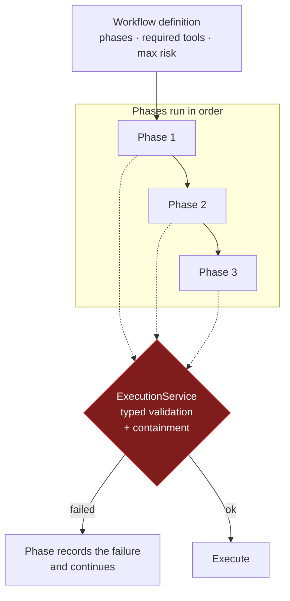
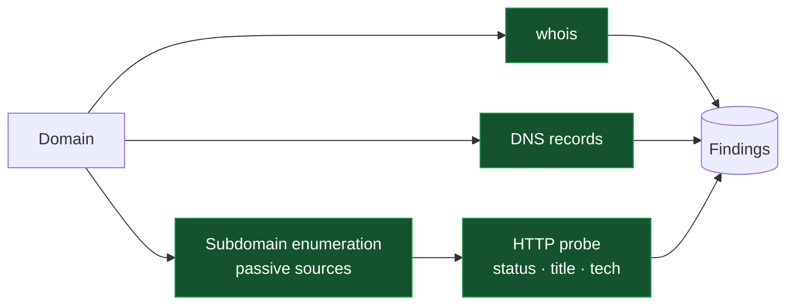
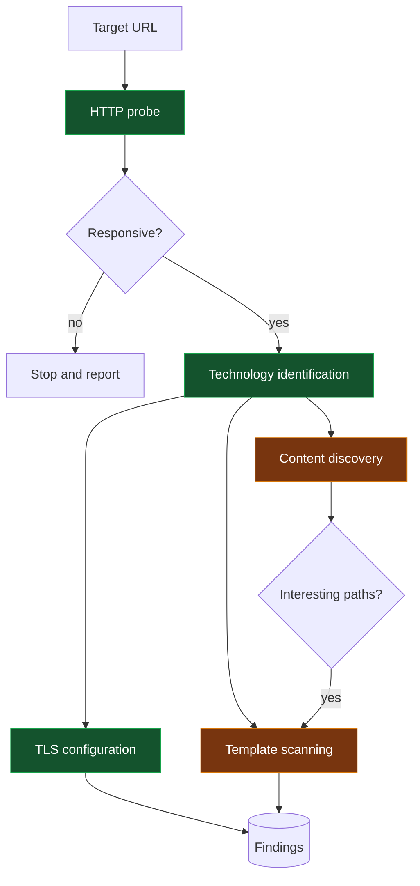
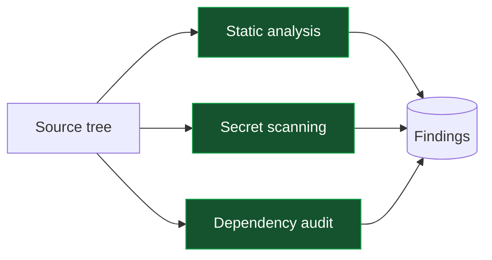
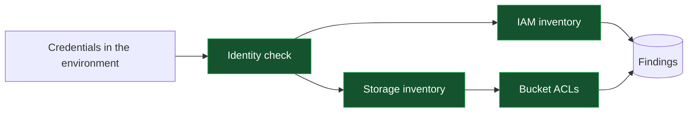
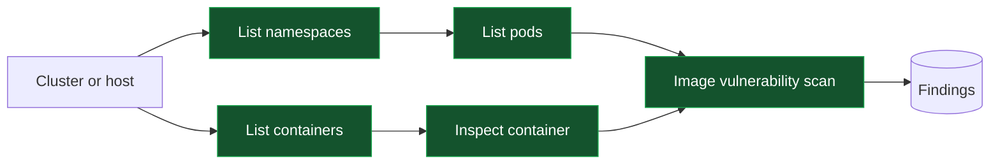

# Workflows

A workflow is a phased sequence of tool executions. Each phase runs through the
same execution path as a single call: a workflow cannot reach a target or a
risk level that a direct call could not.

> Only use NexHunter against systems you own or are explicitly authorized to assess.

## How a workflow relates to the execution path



A workflow is a *plan*, not an authorization. Every step still runs through the
single execution path, so a failed step mid-workflow stops that step rather
than granting the rest a pass.

## Passive reconnaissance

The safest workflow: nothing touches the target directly beyond DNS and public
records.



Risk level: `passive`.

## Web assessment



Risk level: `active` at the discovery and scanning phases.

## Code and dependency review

Operates on a local checkout. No traffic leaves the host, so there is no target
scope to check — but the workspace rules still apply.



Risk level: `passive`.

## Cloud posture review

Every registered cloud action is read-only. There is no CLI passthrough, so a
workflow cannot reach a mutating operation.



Risk level: `passive`. Uses `aws_get_caller_identity`, `aws_list_s3_buckets`,
`aws_get_bucket_acl`, `aws_list_iam_users` and their GCP and Azure equivalents.

## Container review



## Writing a workflow

A workflow declares what it needs up front so it can be validated before
anything runs:

```python
@dataclass(frozen=True)
class WorkflowDefinition:
    name: str
    description: str
    phases: tuple[WorkflowPhase, ...]
    maximum_risk_level: RiskLevel
    required_tools: tuple[str, ...]
```

Rules:

- A phase names registry tools. It never constructs a command.
- `maximum_risk_level` is a ceiling, not a grant: the autonomy loop's ceiling
  still applies.
- A missing tool is reported, not worked around. NexHunter does not install
  binaries.
- A failed step is recorded as a phase result. Workflows do not retry past a
  failure that the tools themselves report.

## Progress reporting

```json
{
  "workflow_id": "...",
  "name": "web-standard",
  "status": "running",
  "current_phase": "technology_detection",
  "progress": 40,
  "executions": [],
  "findings": [],
  "errors": []
}
```

## Current state

The workflow definitions in `workflows/` predate the execution layer and still
drive tools through the older engine path rather than `ExecutionService`.
Migrating them is on the roadmap; until then, per-phase execution records and
workspaces are not produced for workflow runs. Direct tool calls through
`/api/command` and MCP, and autonomous runs through the orchestrator, do get
the full treatment.
